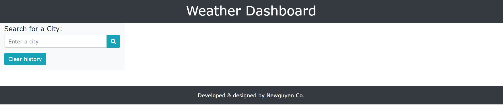
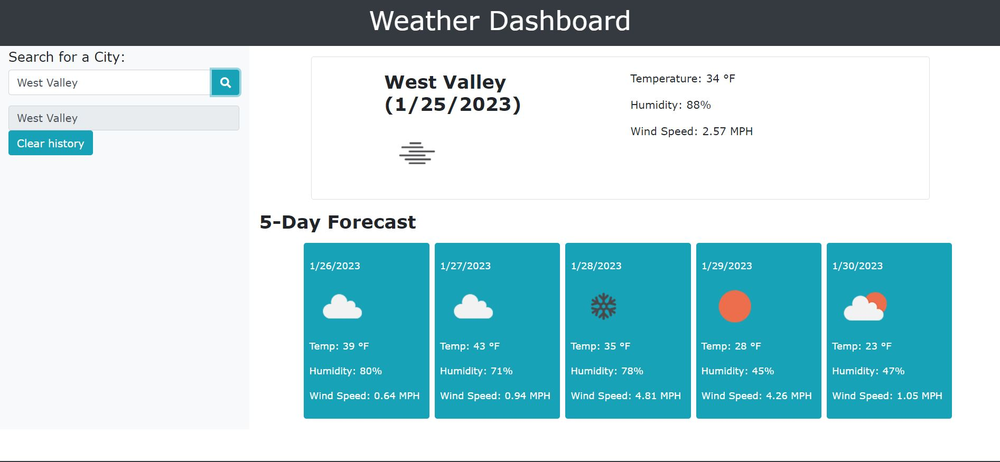
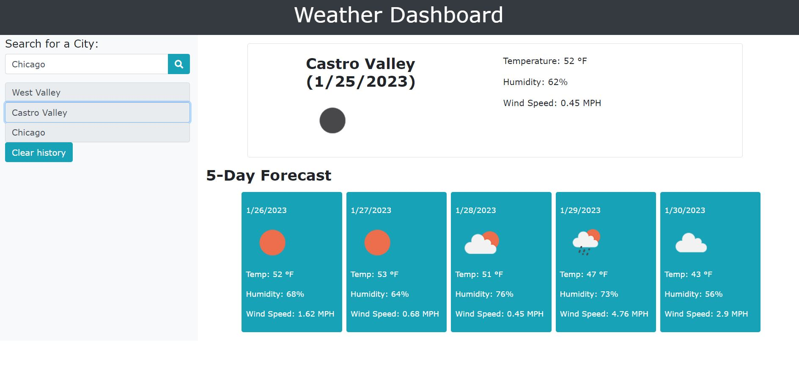

# Weather-Dashboard

## URL
https://newguyengithub.github.io/Weather-Dashboard/

## Description

This project is a weather dashboard that allows the user to input a city and output the current weather conditions and next 5 day forecast weather conditions.
When the user inputs a city name and hit the search button, the city name, date, current weather conditions, and next 5 day forecast weather conditions will be displayed.
The current weather conditions displayed will show the city name, date, icon of the weather condition, the temperature, humidity, and wind speed.
The 5 day forecast weather conditions displayed will show the date, icon of the weather condition, the temperature, humidity, and wind speed.
The search history will be displayed. 
When an item in the search history list is selected, the output of the current weather conditions and next 5 day forecast weather conditions will be displayed.
The clear history button will clear the search history.

## Summary

```
GIVEN a weather dashboard with form inputs
WHEN I search for a city
THEN I am presented with current and future conditions for that city and that city is added to the search history
WHEN I view current weather conditions for that city
THEN I am presented with the city name, the date, an icon representation of weather conditions, the temperature, the humidity, and the the wind speed
WHEN I view future weather conditions for that city
THEN I am presented with a 5-day forecast that displays the date, an icon representation of weather conditions, the temperature, the wind speed, and the humidity
WHEN I click on a city in the search history
THEN I am again presented with current and future conditions for that city
```

## Installation

N/A

## Usage

This is a website that allows user to input a city name and it will output the current weather conditions and next 5 day forecast weather conditions.




## Credits

N/A

## License

Please refer to the LICENSE in the repo.
